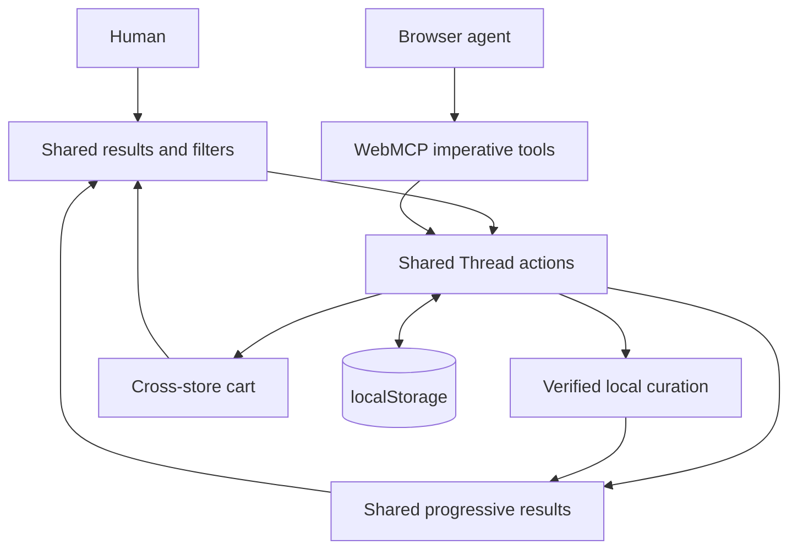

# THREAD

> Your wardrobe for the web.

THREAD is an agent-native fashion workspace for the [OpenAI WebMCP Challenge](https://openai.com/webmcp-challenge/). A browser agent researches real retailer pages and progressively publishes verified products while the person filters, inspects, and curates the same live list.

There is no embedded chatbot, OpenAI API, API key, MCP server, backend, account, or database. THREAD is a client-only Nuxt 4 static application and remains fully usable when WebMCP is unavailable.

## The shared workspace

- **Human workstream:** opens any planned retailer search, filters the accumulated finds by store, brand, category and price, inspects variants, and manages the cart.
- **Agent workstream:** creates a deep retailer plan, opens its URLs in agent-controlled tabs or delegated browser workers, reports per-store progress, and progressively publishes verified product records into the shared list.
- **Shared state:** profile, product registry and cross-store cart are used by both workstreams through one typed action layer.
- **Collision-safe identity:** product IDs are derived from canonical retailer URLs; cart IDs are derived separately from product + size + colour.
- **Local persistence:** profile, agent-published product snapshots and cart survive refresh through `localStorage`.



The durable keys are:

- `thread.profile.v1` (schema version 2)
- `thread.products.agent.v1`
- `thread.cart.v1` (schema version 2)

A new search intentionally replaces the previous list. Publications within that search always accumulate by canonical product ID, regardless of retailer or worker. Until the first search there are no products or retailer links in the interface. Human filters never interrupt publication, and cart actions from either source immediately update the same cart badge and drawer.

## Real-product grounding

`app/data/products.ts` contains a small curated snapshot of real products observed on official Canadian retailer product pages on August 27, 2026. Every record contains:

- canonical retailer product URL
- retailer-hosted product photography
- observed price and currency
- listed colours and sizes
- availability state and observation timestamp
- retailer identity and logo/favicon

Prices and stock are observations, not guarantees. Every card and cart item links back to the retailer so the shopper can recheck the live page before purchasing. Agent submissions are rejected when they use placeholder, search-engine, Pinterest, Instagram, or other non-retailer URLs.

THREAD's searchable retailer directory includes Fashion Nova, SHEIN, Oh Polly, Gymshark, Zara, H&M, UNIQLO, COS, ASOS, Aritzia, Abercrombie, Nike, New Balance, adidas, Mango, Reformation, MESHKI, Princess Polly, Dynamite, Garage, lululemon, SSENSE, Simons, OAK + FORT, Frank And Oak, Everlane, Good American, FARFETCH, Shopbop, REVOLVE, Holt Renfrew, and Saks Fifth Avenue. Deep plans also include Pinterest and Google Shopping as discovery sources, but only canonical retailer product pages can be published.

## WebMCP tools

THREAD registers fourteen imperative tools on `document.modelContext`:

| Tool | Mode | Purpose |
| --- | --- | --- |
| `setup_profile` | Mutating | Creates first-run browser-local profile state without inventing recommendations. |
| `get_style_profile` | Read only | Returns name, shopping department and styles. |
| `get_retailers` | Read only | Returns the extensive retailer directory, official domains and departments. |
| `search_products` | Read only | Replaces the shared list with matches from verified local curation. |
| `begin_retailer_search` | Mutating | Creates a collision-safe search job and clears the previous list. |
| `plan_deep_search` | Mutating | Builds an exhaustive multi-store plan with browser-ready search URLs. |
| `get_research_progress` | Read only | Reads every target, status, count, and search URL. |
| `report_research_target` | Mutating | Reports one worker/store as queued, active, complete, empty, or failed. |
| `publish_products` | Mutating | Validates and accumulates externally verified products without replacing other stores. |
| `finish_retailer_search` | Mutating | Ends the overall pass and exposes any targets left unfinished. |
| `get_visible_products` | Read only | Reads the single visible result list. |
| `add_to_cart` | Mutating | Adds a curated or agent product and prevents exact variant duplicates. |
| `remove_from_cart` | Mutating | Removes one exact cart item by its stable item ID. |
| `get_cart` | Read only | Returns the exact cart and subtotals the human sees. |

Definitions live in `app/webmcp/tools/`; registration is isolated in `app/webmcp/registerThreadTools.ts` and initialized by `app/plugins/webmcp.client.ts`. Registration is client-only, feature-detects `document.modelContext`, avoids duplicates, and uses an `AbortSignal` for safe teardown.

THREAD follows the current [WebMCP Imperative API](https://developer.chrome.com/docs/ai/webmcp/imperative-api) and uses `document.modelContext`, not deprecated `navigator.modelContext` or declarative form markup. Externally sourced outputs are marked with `untrustedContentHint` where appropriate. A page tool cannot grant an LLM control of hidden browser instances; `plan_deep_search` therefore returns explicit targets for the calling agent to open in its own browser tabs or delegated workers. Humans can open the same targets from THREAD's live plan.

## Run and verify

Requirements: Node.js 22+ and npm.

```bash
npm install
npm run dev
```

Then open the URL printed by Nuxt, normally `http://localhost:3000`.

```bash
npm run test
npm run typecheck
npm run generate
npm run build
```

`npm run generate` creates the static deployment under `.output/public`.

## Test WebMCP

WebMCP is experimental and subject to change. In a compatible Chrome build, enable WebMCP testing (or use the current origin trial/ChatGPT in-app browser), relaunch the browser, run THREAD, and complete onboarding.

Append `?debug=true` during local development. The panel shows browser support, discovered tools, shared state, and a progressive agent-publication simulation using the same production actions.

Recommended live-agent demo:

```text
get_style_profile({})

# When the returned name is empty, set up the user without inventing styles:
setup_profile({
  "name": "Chris",
  "gender": "women",
  "styles": ["minimal", "streetwear", "smart-casual"]
})

# Setup leaves the page empty. Begin the user's requested search:
get_retailers({})
plan_deep_search({
  "query": "relaxed dinner clothes under $180 CAD",
  "occasion": "dinner",
  "maxPrice": 180
})

# Open target URLs in agent-controlled tabs/workers, report target progress,
# and publish many batches. Omitting complete keeps the overall search active.
report_research_target({ "searchId": "<id>", "targetId": "target:fashion-nova", "status": "exploring" })
publish_products({ "searchId": "<id>", "targetId": "target:fashion-nova", "targetComplete": true, "products": [ ... ] })
get_research_progress({})
finish_retailer_search({ "searchId": "<id>" })
get_visible_products({})
add_to_cart({ "productId": "<returned Thread ID>", "size": "M" })
get_cart({})
remove_from_cart({ "itemId": "<returned cart item ID>" })
```

`setup_profile` is safe to call defensively: it returns the existing profile without overwriting it unless `replaceExisting: true` is explicitly supplied. Styles are optional so an agent can onboard a new user from only a known name and shopping department; omitted styles remain empty rather than being guessed. It never creates a feed by itself. `search_products` or `begin_retailer_search` starts the shared list, and the next search replaces it.

## Project structure

```text
app/
├── components/
│   ├── cart/
│   ├── common/
│   ├── dev/
│   ├── layout/
│   ├── onboarding/
│   └── shopping/
├── composables/
├── data/
│   ├── products.ts
│   └── retailers.ts
├── domain/
│   ├── productIdentity.ts
│   ├── productFilters.ts
│   ├── productSearch.ts
│   └── threadActions.ts
├── plugins/
│   ├── thread-state.client.ts
│   └── webmcp.client.ts
├── providers/
├── types/
├── utils/
└── webmcp/
    ├── tools/
    └── registerThreadTools.ts
tests/
├── productFilters.test.ts
├── productSearch.test.ts
└── threadActions.test.ts
```

## Commerce boundary

THREAD is a meta-cart, not a payment or retailer-inventory system. It does not claim unified checkout or guaranteed availability. Checkout remains on each official retailer page through the exact product links shown in the UI.
