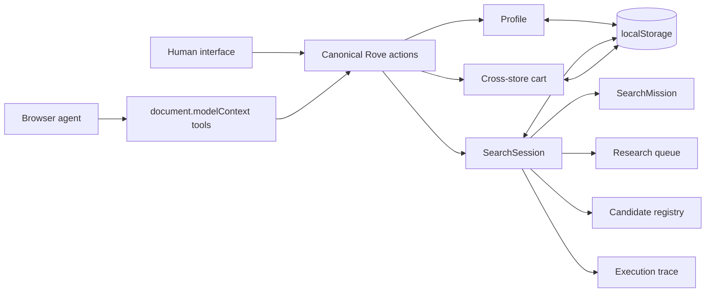

# Rove

> A shared fashion research workspace for people and browser agents.

Rove’s product thesis is:

> “Rove is a shared fashion research workspace where a browser agent researches the open web and progressively publishes products into the same workspace that the human is simultaneously browsing, filtering, inspecting, and curating.”

The browser agent supplies web navigation and intelligence. Rove supplies the typed shopping mission, profile, retailer semantics, deterministic research scheduler, candidate validation, product ranking, persistence, cart, human interface, and WebMCP tools.

Rove is a client-only Nuxt 4 / Vue 3 / strict TypeScript / Tailwind application for the [OpenAI WebMCP Challenge](https://openai.com/webmcp-challenge/). It has no backend, database server, API key, OpenAI API call, embedded chatbot, MCP server, scraping service, product-aggregation service, account system, or cloud persistence. The static build remains usable when WebMCP is unavailable.

## Human and agent share one state



Human and WebMCP operations converge on `app/domain/threadActions.ts`; the UI does not maintain a parallel implementation. A human can keep filtering, browsing, opening details, and managing the cart while the browser agent claims retailer work and progressively publishes products.

Rove supports one workspace tab plus browser-agent-controlled retailer tabs. Cross-tab Rove state synchronization is intentionally not claimed. Search IDs and target claims prevent old retailer workers from publishing into a replacement, cancelled, or completed mission.

## SearchMission

`start_shopping_search` is the only normal entry point for a shopping request. It stores:

- the original prompt;
- shopping department and style preferences;
- optional trip, destination, climate, occasion, and notes;
- concrete needs with retailer-search queries, category signals, required quantities, and optional per-need CAD budgets;
- explicit per-item and overall CAD budgets, category, retailer, and exclusion constraints;
- the final deduplicated query set and creation time.

The browser agent can provide structured semantic context. Rove also performs small deterministic fallbacks: it recognizes simple categories and budgets, and expands an obvious vacation request such as “Get my clothes for vacation in Cancun” into resort-daytime, beach/pool, and evening-dinner needs. It does not call an LLM or pretend to browse.

## Retailer adapters and research queue

`app/data/retailers.ts` is a registry of retailer adapters. Each adapter owns:

- canonical domains and phrase-safe aliases;
- supported departments;
- categories, styles, occasions, price tier, and retailer type;
- a search URL template;
- product URL/domain semantics.

Retailers are scored from department compatibility, category coverage, style and occasion overlap, budget/price-tier fit, profile preferences, and warm-weather relevance. Results are sorted by score and a stable retailer ID tie-breaker, so registry array order cannot determine priority. Generic substring aliases such as `shop` are not used.

Every eligible retailer becomes a persisted target. Each target keeps only the mission needs, queries, and URLs that its declared category capabilities support. Discovery sources are scheduled last unless the mission explicitly restricts retailers. Targets move through:

```text
queued → claimed → exploring → complete
                           ↘ no-results
                           ↘ failed
queued / claimed / exploring → cancelled
queued → skipped (only after required needs are satisfied)
```

`claim_search_targets` returns only 1–4 targets at a time. Priority is recalculated at every claim from the needs that remain unfulfilled, with extra weight for required and scarce capabilities such as fragrance. Each target contains a small need-specific query set and browser-ready URLs. `complete` requires at least one accepted product; zero-product checks must use `no-results` with a reason, and failures require a reason.

Rove builds a deterministic proposed basket from grounded products with verified CAD prices. A mission may stop early only when every required quantity fits its per-need budget and the overall budget, no target is still claimed or exploring, and every untouched queued target is retained as `skipped` with the reason “skipped after satisfaction.” Otherwise the full plan continues. The original target plan is never rewritten to manufacture completion.

## Candidates, enrichment, integrity, and ranking

Product publication is intentionally two-stage:

1. `publish_candidates` accepts listing-page candidates with canonical `url`, `name`, and a direct product `image` as required fields. Price, brand, category, and department can be supplied when observed.
2. `enrich_product` adds variants, availability, material, description, tags, and detailed pricing when the user inspects or wants to cart a candidate.

Rove derives canonical product ID, search ID, target ID, observed time, source, and known retailer identity. For known retailers, submitted names never override the registry. Retailer targets reject products from another domain. Discovery targets may introduce an unknown canonical retailer product page, but never a search, Pinterest, Google, social, placeholder, or root URL.

Hard mission constraints are enforced inside Rove:

- shopping department;
- explicit category;
- retailer allow/exclusion lists;
- active search ID;
- per-item CAD budget;
- target and product domain;
- product-like canonical URL.

Pricing keeps `nativePrice`, `nativeCurrency`, and `priceCad` separate. CAD listings derive `priceCad` directly. Non-CAD listings require an explicitly verified `priceCad`; Rove never guesses an exchange rate or compares unlike currencies.

The active session retains up to 600 unique candidates. When the documented limit is reached, new unique candidates are explicitly rejected; existing data is never silently truncated. Rove refuses to replace an active mission; it must first be completed, satisfied, cancelled, or explicitly abandoned. Up to three terminal sessions are retained as read-only recent searches, while cart snapshots remain stable.

Recommended order is deterministic rather than arrival order. It combines mission/query/category relevance, profile style match, occasion match, budget fit, retailer relevance, availability, freshness, and completeness. A greedy diversity pass then applies retailer repetition and near-duplicate penalties plus category-coverage bonuses.

## Browser-local persistence and trace

The current versioned keys retain their original `thread.*` namespace so the Rove rebrand never discards existing browser-local data:

- `thread.profile.v4`;
- `thread.search.v4`;
- `thread.cart.v3`.

Legacy v1/v3 profile, v3 search, and v1 cart snapshots are migrated when possible. The persisted `SearchSession` includes its mission, targets, products, proposed fulfillment plan, rankings, counts, revision, and the latest 250 trace events. Refreshing the workspace preserves the search ID, queue states, candidates, and progress.

Trace events include search creation, target ranking and claims, candidate receipt/acceptance/rejection, target completion/failure, enrichment, satisfaction, completion, and cancellation. Open `?debug=true` in development to inspect the exact state and trace, refresh registered tools, or run a fixture-backed end-to-end simulation. The small catalog in `app/data/products.ts` is used only by tests and that debug simulator; it is not exposed as normal shopping discovery.

Profiles expose exactly 15 curated styles derived from Copnow’s broader taxonomy while preserving Rove’s existing IDs. The human selector requires 3–10 choices. Identity and body details are optional, self-described, browser-local, and never used to infer skin tone.

## Discovery interface and commerce boundary

Products render in a lightweight CSS-column masonry feed: roughly two columns on mobile, three to four on tablet, and five to six on wide desktop screens. Image proportions remain useful, new candidates enter progressively, and existing filters and scroll position are not reset by publication.

The human can filter by retailer, brand, category, and verified CAD price; sort by recommendation, price, or observation time; inspect candidate provenance; open the canonical product page; and add enriched variants to the cart.

Your Thread is a cross-store meta-cart, not a unified checkout or inventory system. Products require only the variants their listing actually exposes: apparel may require size or colour, while fragrance and fixed-listing accessories are added as listed. Candidate-only products must be enriched or opened at the retailer. Checkout always remains on each official retailer page.

## WebMCP tools

Rove registers seventeen imperative tools:

| Tool | Mode | Purpose |
| --- | --- | --- |
| `get_profile` | Read only | Read all saved profile fields. |
| `setup_profile` | Mutating | Create the minimal profile without overwriting existing data by default. |
| `update_profile` | Mutating | Incrementally learn optional user-approved preferences. |
| `start_shopping_search` | Mutating | Create and persist one structured mission and ranked queue. |
| `claim_search_targets` | Mutating | Claim 1–4 queued targets prioritized around unmet needs. |
| `publish_candidates` | Mutating | Validate and upsert inexpensive listing-page candidates. |
| `enrich_product` | Mutating | Hydrate one candidate for detail, availability, or cart use. |
| `complete_search_target` | Mutating | Resolve a target as complete, no-results, or failed. |
| `get_search_status` | Read only | Read mission, fulfillment/budgets, target states, coverage, and next action. |
| `get_products` | Read only | Page/filter/sort up to 100 ranked products at a time. |
| `review_recommendations` | Mutating | Accept a completed edit or replace only selected products. |
| `research_again` | Mutating | Start a fresh pass without repeating prior product links. |
| `get_research_history` | Read only | Read saved prompts and accepted edits. |
| `cancel_search` | Mutating | Cancel or abandon unresolved work while preserving accepted products. |
| `get_cart` | Read only | Read the exact shared cart and CAD total. |
| `add_to_cart` | Mutating | Add an enriched exact product variant. |
| `remove_from_cart` | Mutating | Remove one stable cart item. |

Every schema rejects additional properties. Mutating tools have `readOnlyHint: false`; externally sourced product/retailer outputs use `untrustedContentHint: true`. Registration is client-only, feature-detects `document.modelContext`, prevents duplicates, and tears down with one `AbortController`.

The registration path is equivalent to this literal Imperative API shape:

```ts
const controller = new AbortController()

await document.modelContext.registerTool({
  name: 'get_profile',
  title: 'Get Rove profile',
  description: 'Read the browser-local shopping profile before starting a mission.',
  inputSchema: {
    type: 'object',
    properties: {},
    additionalProperties: false,
  },
  annotations: {
    readOnlyHint: true,
  },
  execute() {
    return { profile: actions.getProfile() }
  },
}, { signal: controller.signal })
```

Rove uses `document.modelContext`, not `navigator.modelContext`, a custom MCP server, or declarative form tools.

## Run and verify

Requirements: Node.js 22+ and npm.

```bash
npm install
npm run dev
```

Nuxt normally prints `http://localhost:3000`. Production checks:

```bash
npm run test
npm run typecheck
npm run generate
npm run build
```

The static output is generated under `.output/public`.

## Recommended live-agent demo

Complete onboarding, then ask:

```text
Get my clothes for vacation in Cancun.
```

The browser agent should follow this loop:

```text
get_profile
→ start_shopping_search
→ claim_search_targets
→ browse returned retailer URLs
→ publish_candidates (multiple products per listing where relevant)
→ enrich_product (only when detail/variant verification is useful)
→ complete_search_target
→ claim_search_targets
→ repeat until get_search_status reports satisfied or completed
→ get_products
→ add_to_cart / get_cart
```

Representative mission creation:

```json
{
  "rawPrompt": "Get my clothes for vacation in Cancun.",
  "context": {
    "tripType": "vacation",
    "destination": "Cancun",
    "climateHints": ["hot", "humid", "tropical"],
    "occasions": ["vacation", "beach", "resort", "dinner"]
  },
  "needs": [
    {
      "intent": "resort daytime",
      "queries": ["linen shirt", "relaxed shorts"],
      "categories": ["tops", "bottoms"]
    },
    {
      "intent": "beach",
      "queries": ["swimwear", "sandals"],
      "categories": ["swimwear", "footwear"]
    },
    {
      "intent": "evening dinner",
      "queries": ["linen trousers", "knit polo"],
      "categories": ["bottoms", "tops"]
    }
  ]
}
```

Also verify the simpler request `Find me a black shirt under $70 CAD`; Rove should store a tops constraint, enforce the CAD budget, and still schedule retailers by relevance rather than registry order.

## Project structure

```text
app/
├── components/              human workspace, masonry feed, progress, cart, debug
├── composables/             canonical browser-local state access
├── data/
│   ├── products.ts          development/test fixtures only
│   └── retailers.ts         retailer adapters and deterministic scoring
├── domain/
│   ├── products/            candidate validation, enrichment, ranking, diversity
│   ├── profile/             schema validation and migration
│   ├── research/            target scheduler, coverage, telemetry
│   ├── search/              SearchMission construction and validation
│   ├── persistence.ts       versioned hydration/migration
│   └── threadActions.ts     shared human + WebMCP action boundary
├── plugins/                 state hydration and client-only WebMCP registration
├── types/                   strict domain contracts
└── webmcp/                  closed schemas, outputs, registration, tools
tests/                       deterministic unit/integration tests
```
